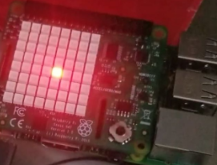
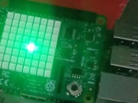
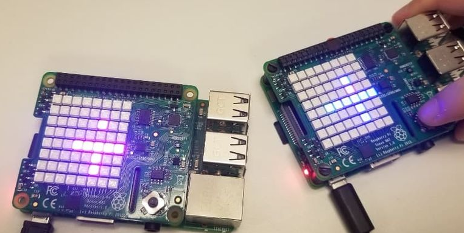

# Bomberry Pi

## Description

Bomberry Pi is a 2-player online game running on Raspberry Pi with Sense HAT, written in Python. 

The objective of the game are trying to survive and placing bomb to defeat other player. 

The winner of a round will be scored after having eliminated the enemy player, and the game will continue to play and score until one player disconnects.

The game is inspired by the first “bomb” game, the action maze game Super Bomberman.

This repository contains the client-side code for Bomberry Pi

## Server

Server-side code for Bomberry Pi [here](https://github.com/khaitruong922/bomberry-pi-server)

## Contributors

- Khai Truong - [khaitruong922](https://github.com/khaitruong922)

- Tung Ngo - [woldoge](https://github.com/woldoge)

## Setup

Run the following command on Raspberry Pi to install socketio client for Python.

```
python3 -m pip install "python-socketio<5"
```

Run main.py

If there are two Pis running, they will be matchmade into the same game

## Preview

||
|:--:| 
| *Connecting to server* |

||
|:--:| 
| *Connected to server* |

||
|:--:| 
| *Gameplay* |

## Demo video

[Link](https://youtu.be/q8A4-A5a5ho)
